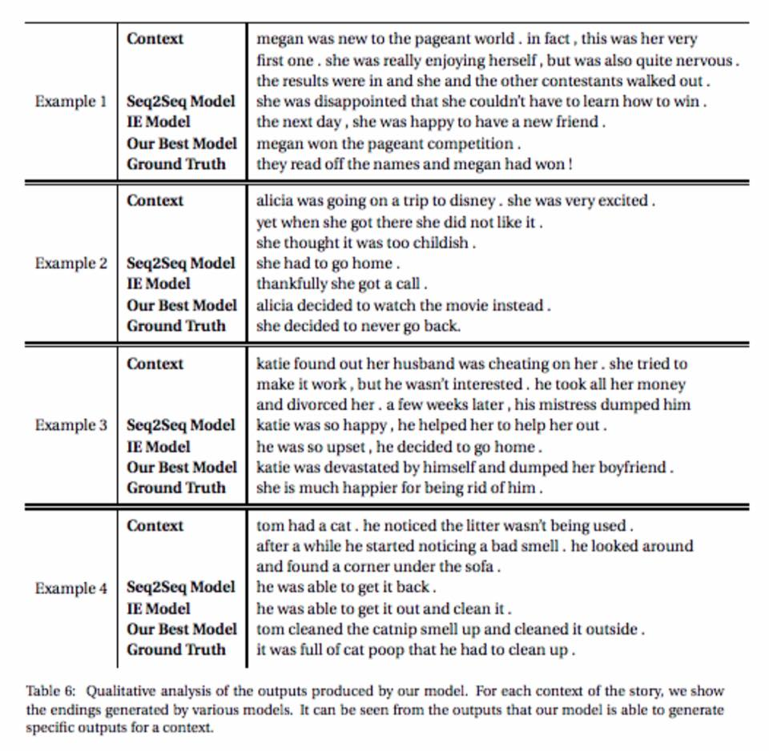

# WriterForcing-by-Carnegie-Mellon-University

Artificial Intelligence can generate interesting story endings. It picks important phrases of a story and creates more “diverse” endings.

Great work on WriterForcing by Carnegie Mellon University, which takes Seq2Seq models to the next level.

Read https://arxiv.org/pdf/1907.08259.pdf?fbclid=IwAR3ZJu3QuK69ysTw-1x86zMoQ8CwIfNMVLgfVdyhibDWwk9IS_b5QgYp6H4
